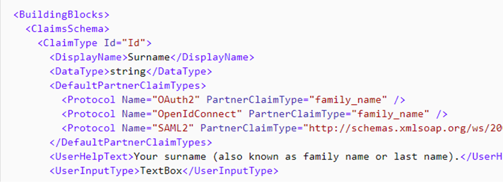
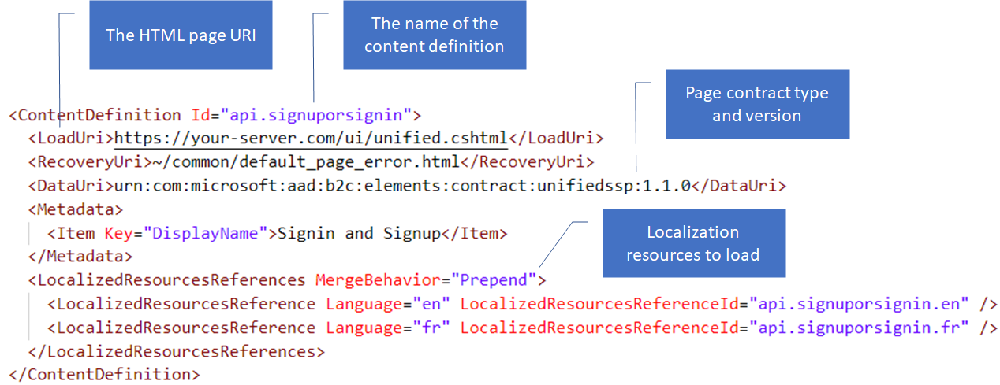
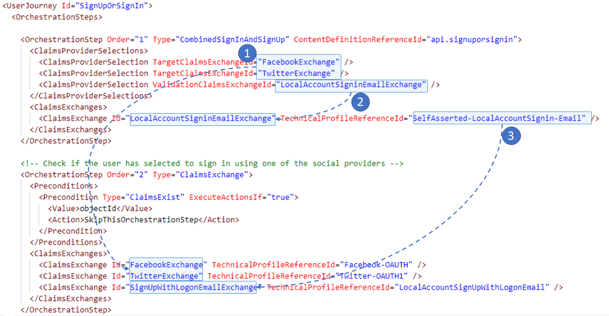

Using a hierarchical chain, a custom policy is broken into one or more XML-formatted files. 

- These files are comprised of several components such as, the claims schema, technical profiles, and much more.

- Each policy file is defined within the root-level **TrustFrameworkPolicy** element.

## Trust framework policy 
The TrustFrameworkPolicy element specifies the unique identifier to the **tenant name** to which the policy belongs. And the **policy name**. A custom policy should start with **B2C_1A_**. This is important as you will want granular control on different user journeys.

## Base policy element
To chain files together and build the inherited file structure, a **BasePolicy** element must be declared under the TrustFrameworkPolicy element of the policy file. The BasePolicy element is a reference to the base policy from which this policy is derived. <!--Note: It is important to ensure consistency when referencing your tenant name.-->

## Building blocks
Within the Trust Framework Policy, we have a set of elements that that helps manage the data received and sent from different connections. These set of elements are called the Building Blocks.

The BuildingBlocks element contains the following. Note, the order of elements must follow this order when defined:
- **Claims schema** - Contains the list of claims used by your policy.
- **Predicates and Predicate validations** - Enables you to perform a validation process to ensure that only properly formed data is entered into a claim.
- **Claims transformations** - A list of claims transformations that can be used in your policy. A claims transformation manipulates one claim into another.
- **Content definitions** - Contains URLs for HTML5 templates to use in your user journey for custom page layouts, and a reference to localized resources.
- **Localization** - Provides multiple language support when rendering pages to your users.

### Claims schema
Claims schema is the place where you declare your claims. A claim can be first name, last name, display name, phone number and more. The ClaimsSchema element contains a list of **ClaimType** elements. The ClaimType element contains:
- **Id** attribute (claim name)
- **Display name** - The title that's displayed to users on various screens. The value can be localized
- **Data type** - The type of the claim. The data types of boolean, date, dateTime, int, long, string, stringCollection and more.
- **User help text** - A description of the claim type that can be helpful for users to understand its purpose. The value can be localized.
- **User input type** - The type of input control that should be available to the user when entering the claim data for the claim type.

 
### Claims Transformations
A claims transformation converts a given claim into another one
In the claims transformation, specify the transform method. For example, specify a transform method that adds an item to a string collection or changes the case of a string. A claims transformation contains: 
- **Id** an arbitrary name you define to reference this claim transformation within a Technical Profile.
- The **transform method** to apply.
- A list of **InputClaim** elements that specify claim types that are taken as input to the claims transformation.
- A list of **InputParameter** elements that are provided as input to the claims transformation.
- A list of **OutputClaim** elements that specify claim types that are produced after the ClaimsTransformation has been invoked.

<!--This is very similar logic in how you would do claim transformation with AD FS: 1) Claims come in. 2) Claim values are altered based on logic. 3) 
A new claim value is provided-->

The following claims transformation creates a userPrincipleName, by using the string format method – here is an example of a claim transformation policy called "CreateUserPrincipalName".

### Content definitions
Azure AD B2C can provides a content definition interface that allows customizing the look and feel of any self-asserted technical profile. This is important as it applies loading certain UI elements based on versioning and page identifiers. 

## Claims Providers 
<!--Technical profile provides a framework with a built-in mechanism to communicate with different types of parties using a custom policy in Azure AD B2C. -->TechnicalProfile elements are organized under the **ClaimsProvider** element. In the following example, the first being a Facebook claims provider with a single technical profile. The others following, are Azure AD claims providers, including multiple technical providers. A claims provider element can help organize technical profiles. It is possible to have all technical providers within a single claims provider element, or to have each technical profile within its own claims provider element. The claims provider element offers the ability to group and organize technical profiles that are related to each other.

### Technical profiles
All technical profiles can contain the same set of XML elements, share the same concept and execute in the same way. But the goal of the XML element may change from one technical profile to another. For example, an **OAuth2 technical profile**, has a different set of metadata than an **Azure AD technical profile**. The input claims for a self-asserted technical profile pre-populate the data on the page, while in a REST API, B2C sends input claims to the REST Service in a JSON payload.

The **SelfAsserted-LocalAccountSignin-Email** technical profile renders the combined local account sign-in sign-up page. 

The technical profile collects the sign-in name (email address) and the password from the user. When user clicks on sign-in, the _login-NonInteractive_ validation technical profile validates the credentials, and returns the user object properties from the directory. If the account was not found or a bad password was entered, the validation technical profile raises an error message. 

You cannot collect more data from the user in the combined sign-up or sign-in page. You can localize the elements of the screen and error messages using content definition localization. 

This technical profile has:
- **Id** – The technical profile name. The sign-up or sign-in user journey calls this technical profile by its Id.
- **Protocol** - Proprietary, this is an Azure AD B2C internal protocol that allows interaction with a user object in the directory.
- **Metadata** – Contains the content definition to load.
- **Input claims** – Such that Azure AD B2C can pre-populate the username.
- **Output claims** - Claims (data) to be provided by the end user. This technical profile has four output claims. Only signInName and password are presented to the user. Whilst the objectId and the authenticationSource are returned by the validation technical profile and therefore Azure AD B2C will not display these to the user on the rendered page.
 - **Validation technical profile** - Azure AD B2C executes the login-NonInteractive technical profile to validate the user credentials when the user submits the page, and returns the user object properties. Most importantly the users objectId.

Similar to the **SelfAsserted-LocalAccountSignin-Email**, the **Facebook-OAUTH** technical profile contains similar elements.

- **Protocol** - OAuth2, Azure AD B2C will communicate with Facebook over OAuth2.
- **Metadata** - Relevant configuration options to the OAuth2 protocol, such as the Facebook authorization endpoint.
- **Cryptography Key** – Used when Azure AD B2C redeems the authorization code for an access token using the client secret stored in the specified cryptography key reference.
- **Input claims** - None, we do not send anything to Facebook except an authentication request.
- **Output claims** - Claims parsed from the JWT issued by Facebook and added to the Azure AD B2C claims bag. Some of the claims have a mapping, to map between the Azure AD B2C claim name and the claim name used by Facebook. Identity provider and authenticationSource claims aren't returned by Facebook. But rather explicitly set using a default value such that they can be used as part of **preconditions** in subsequent orchestrations steps. 

As part of the starter pack, the Facebook technical profile is declared in the **Base** policy, but has an override in the **Extension** policy. This is such that we follow the recommendation to keep the **Base** file static, and make changes in subsequent files in the file structure. The per environment configuration for Facebook is therefore done in the **Extension** policy.

## User Journeys

### Orchestration step

The first two orchestration steps are related to each other. Since the first one contains a **ClaimsProviderSelection**, it allows the user to select the desired identity provider they would like to sign-in with. The following orchestration step, must contain the actual execution of the selected button by referencing a technical profile.

- The **type** of orchestration step 1, is **ClaimsProviderSelection**. This indicates that the orchestration step presents various claims providers to the user for them to select. 
- The first orchestration step also specifies the identifier of the content definition associated with this orchestration step (api.signuporsignin). B2C renders this content definition on the sign-up or sign-in page.
- When a user clicks on the Facebook button (1), the policy executes the FacebookExchange claims exchange in the second orchestration step by executing the Facebook-OAUTH technical profile.
- When a user signs-in with a local account (2) the LocalAccountSigninEmailExchange claims exchange is executed in the same orchestration step. The LocalAccountSigninEmailExchange claims exchange invokes the SelfAsserted-LocalAccountSignin-Email technical profile, which asks the user to provide their credentials and calls the login-NonInteractive to validate their credentials. 
- When a user clicks on sign up (3), the user skips to the second orchestration step, to execute the SignUpWithLogonEmailExchange claims exchange. B2C knows to call SignUpWithLogonEmailExchange because it's configured in the SelfAsserted-LocalAccountSignin-Email technical profile metadata 
    `<Item Key="SignUpTarget">SignUpWithLogonEmailExchange</Item>`

The rest of the orchestration steps always have a single claims exchange element. And may or may not contain preconditions.

## Relying party policy
The applications (web or mobile) are called Relying Party, because they rely on the Identity Provider (Azure AD BC). A relying party application calls the relying party policy. <!--You can treat the relying party policy as IDP authorization and token endpoints.--> The RP policy file executes a specific **user journey**. The relying party policy specifies:
- The tenant name and policy name.
- The base policy to inherit from.
- The Default User Journey which specified which user journey to be executed. The user journey itself must be configured in one of the policy files in the hierarchy chain, including the relying party policy itself.
- The output claims specify the list of claims to be included in the id token and sent back to the application.

 

 

