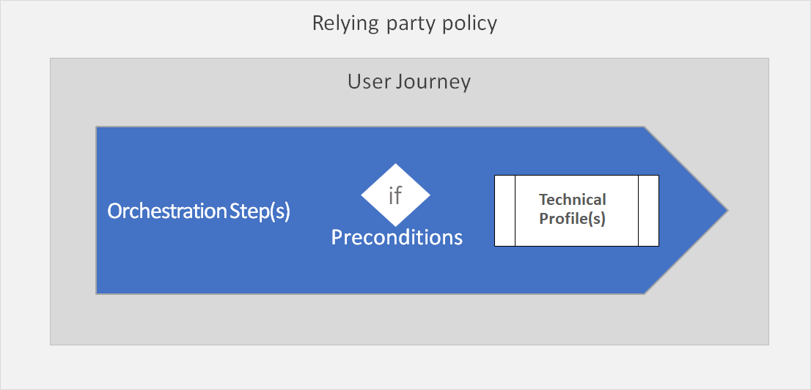
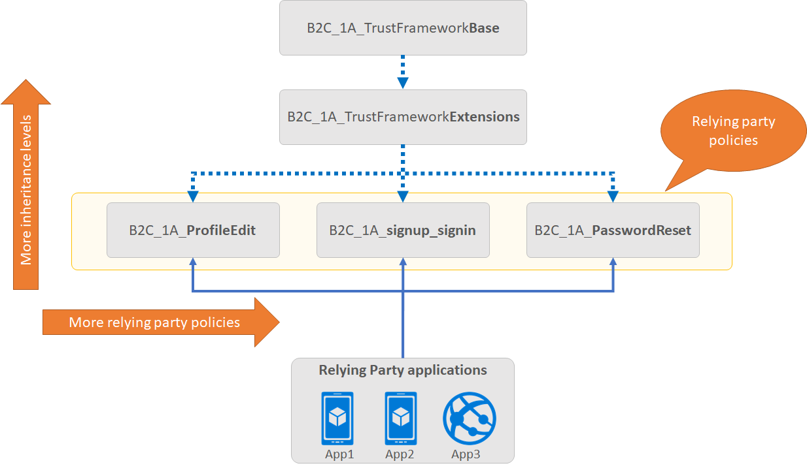

Custom policies are XML configuration files that define the behavior and user experience of an Azure AD B2C policy, with the use of:
- Claim definitions
- Claims transformations 
- Technical profiles
- User journey/s
- Replying Party 

While built-in policies (also referred to as User Flows) are predefined in the Azure AD B2C portal for the most common authentication journeys, custom policies can be fully edited by an identity developer to complete many different tasks wrapped in an authentication journey. 

## Policy execution
Your **relying party application** calls a **relying party policy**. The relying party policy specifies which **user journey** to execute. 

A user journey defines the business logic of what a user will experience. Each user journey is a set of orchestration steps that performs a series of claims exchanges with various partners, in a consecutive order adding to the claims bag as each step completes. 

Each **orchestration step** calls a Technical Profile. Technical profiles provide a framework with a built-in mechanism to communicate with known Azure AD B2C components, REST APIs and Identity Providers via open standard protocols. 

An orchestration step may have one or more **preconditions** to determine if the orchestration step should execute during this flow or skipped.

## Policy file structure

An Azure AD B2C policy follows an inheritance model, whereby configurations being made in a chained file can take dependencies on configuration elements defined earlier in the chain of files. This allows you to scale your design without impacting other work that you have created and add additional policies to leverage existing work.

Let’s look at a relying party application (at the bottom of the diagram). It calls the Relying Party policy file to execute a specific task to initiate the sign-in flow. 

The Identity Experience Framework in Azure AD B2C stacks all of the elements from the Base file, completing the chain of files to the Relying Party policy file to assemble the current policy in effect. Elements of the same type and name in further in the chain of files override those elements those already configured in file earlier in the chain.

As described in the diagram, your application will always reference the relying party policy id as part of the authentication request.

The child policy at any level can inherit from the parent policy and extend it by adding new elements or overriding some or all of the elements in the parent policies.

There is no limit on the number of levels in this chained structure. 

- A relying party application, such as a web, mobile, or desktop application, calls the relying party (RP) policy. 
 - The RP policy configures the list of claims the relying party application receives as part of the token that is issued. 
 - Multiple applications can use the same policy. All applications will receive the same token and claims in this case.
- A single application can use multiple policies and each application could receive different claims in the returned token.
- A relying party policy, points to the user journey to be executed
- A tenant can have multiple polices (built-in and custom). You can combine a built-in policy with custom policies. For example the sign-in journey can be a custom policy, whilst the profile edit journey can be a built-in policy.

## Relying party policy endpoints
For each relying party policy created, Azure AD B2C provides you  the endpoints that your application may use:
- **Well-known configuration** – which provide the metadata for Azure AD B2C.
    - `https://tenant-name.b2clogin.com/tenant-name.onmicrosoft.com/policy-id/oauth2/v2.0/.well-known/openid-configuration`

- **Authorize** endpoint to make authentication requests
    - `https://tenant-name.b2clogin.com/tenant-name.onmicrosoft.com/policy-id/oauth2/v2.0/authorize`

- **Token** endpoint to redeem authorization codes for access tokens
    - `https://tenant-name.b2clogin.com/tenant-name.onmicrosoft.com/policy-id/oauth2/v2.0/token`

- **Logout** to logout the user from Azure AD B2C.  
    - `https://tenant-name.b2clogin.com/tenant-name.onmicrosoft.com/policy-id/oauth2/v2.0/logout`

<!-- -->

