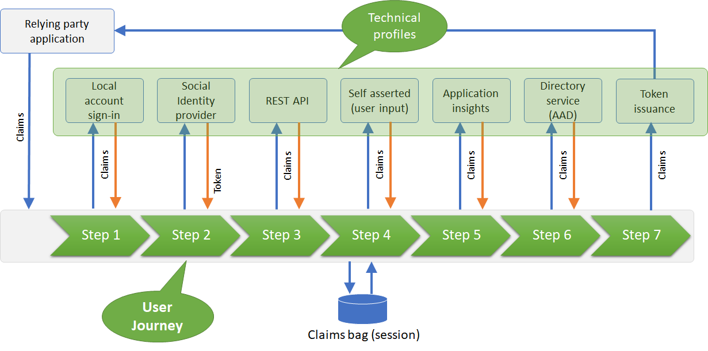

A user journey defines the overall user experience that a Azure AD B2C policy will provide when the Identity Experience Framework processes the authentication request. The user is taken through a series of steps to retrieve the claims that are to be presented to the relying party. 

Each user journey is a consecutive sequence of **orchestration steps**. Each step has a defined type that specifies the overall type of step to be executed, and a reference to the technical profile which fulfills that execution. 

For example the type "IdP selection" -  This lets the user select with whom they would like to login with from a list of identity providers (sign-in with local account, Facebook, Microsoft account, Twitter, Google, ect.). 

If a user selects to sign-in with a _local account_, there is an orchestration step in which specifies the technical profile that collects and validates the user credentials and returns the user object Id to the claims bag. 

If a user selects to sign-in with a _social account_, the next orchestration step takes the user to the selected identity provider, such as Facebook. 

In the majority of cases, the last orchestration step type issues the token and redirects the user back to the application.

In the following example, we have 7 steps. But a user may not run through all of them. Because a step may contain **preconditions** instructing the policy to skip to the next orchestration step, based on claim comparison or claim existence. This is very similar to an **If** and **Else** statement.



## Local and social accounts user journey
The sign-up or sign-in user journey contains the following orchestration steps:

1. Initiates an identity provider selection: Shows the identity provider options to user. If user provides credentials on this screen, then they have chosen to login with a local account. If the user clicks on one of the social identity providers, B2C will move directly to the next step to handle this.

    

1. If user had signed-in locally (in the previous orchestration step/s), skip this step, since in this step we want to handle external account logins. In this step sign in with the social provider selected earlier by executing its respective technical profile, or register new user with a local account. 

    

1. If local account had been chosen earlier (user had signed-in or signed-up with a local account), skip this step, otherwise lookup the social account by the social account unique id obtained from the social identity provider and read its attributes from the Azure AD B2C directory. 

    In this step, B2C attempts to find a representation of the social account in the directory. If the account is not found, B2C will not raise an error message, since this means the user has signed-in with Facebook for the first time.

1. If a social account representation of a user was found skip this step. Otherwise since this user logging in for the first time with their social account, present the user a registration form. Once the user submits this page create the account in the directory. The Self-Asserted technical profile invokes a validation technical profile that actually writes the account into the directory.

    

1. If this is a social account login, skip this step, else read all desired attributes from the user signed in with a local account from the user directory.

1. Create a token with the claims of the user collected during the user journey to send back to app within the id token.

## Preconditions
Preconditions can be used similar to an if/else statement. They can be used to conditionally execute an orchestration step (technical profile), or validation technical profile.

The following is an example which applies a precondition to an orchestration step within the user journey.
This orchestration step will execute a technical profile, therefore the precondition governs whether the technical profile will or will not be run.

```xml
<OrchestrationStep Order="5" Type="ClaimsExchange">
    <Preconditions>
        <Precondition Type="ClaimsExist" ExecuteActionsIf="true">
            <Value>objectId</Value>
            <Action>SkipThisOrchestrationStep</Action>
        </Precondition>
    </Preconditions>
    <ClaimsExchanges>
        <ClaimsExchange Id="AADUserWrite" TechnicalProfileReferenceId="AAD-UserWriteUsingAlternativeSecurityId" />
    </ClaimsExchanges>
```

Breaking this down:
1. This states that this precondition will execute the desired action if the claim exists in the Azure AD B2C claim bag.
```xml
<Precondition Type="ClaimsExist" ExecuteActionsIf="true">
```

2. This states that the claim which is being evaluated to being within the claim bag is called `objectId`.
```xml
<Value>objectId</Value>
```

3. This is the action which will be executed once the condition is met.
```xml
<Action>SkipThisOrchestrationStep</Action>
```

If the condition is not met, then the orchestration step is not skipped, and the technical profile is executed.

A precondition can also base its result on the value of a claim.
```xml
    <Precondition Type="ClaimEquals" ExecuteActionsIf="true">
        <Value>name</Value>
        <Value>John Smith</Value>
        <Action>SkipThisOrchestrationStep</Action>
    </Precondition>
```

For preconditions based **Boolean** claims, the `Value` must be `True` or `False`, this is case sensitive.

For more information on configuring a precondition, see this [reference](https://docs.microsoft.com/en-us/azure/active-directory-b2c/userjourneys#preconditions) for preconditions to control the execution of orchestration steps, and this [reference](https://docs.microsoft.com/en-us/azure/active-directory-b2c/validation-technical-profile#validationtechnicalprofiles) to control the execution of validation technical profiles.

